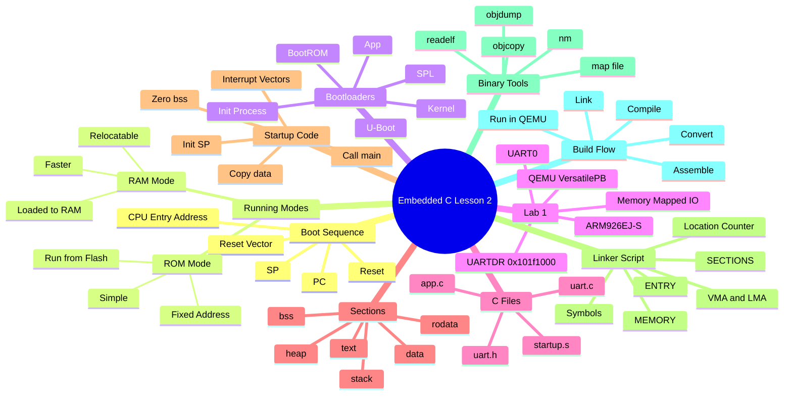

# Unit 3 Embedded C Lesson 2 - Complete Beginner Study Guide

Source PDF: `C:\Users\khalifa\Downloads\Lesson2-20260525T094358Z-3-001\Lesson2\Copy of Copy of unit3_EmbeddedC_lesson2.pdf`

This guide explains the 126-slide lesson in order. The main language is simple English, with Arabic clarifications for hard embedded terms. The goal is deep understanding: what happens, why it happens, and how it appears in real ARM microcontrollers, STM32-style bare-metal projects, and QEMU ARM labs.

## Before the Slides: The Mental Model

An embedded program does not start like a normal desktop program. On a PC, an operating system loads your program, prepares memory, and calls `main()`. In bare-metal embedded systems, there may be no operating system. The CPU wakes up from reset, fetches its first instruction from a fixed address, and your firmware must prepare the system before C code can run safely.

Think of the system as four pieces:

- CPU: executes instructions. Important registers include `PC` and `SP`.
- Flash or ROM: non-volatile memory. It keeps code after power is removed.
- RAM or SRAM/DRAM: volatile memory. It is fast, writable, and empty/undefined after reset.
- Peripherals: UART, GPIO, timers, SPI, I2C, Ethernet, etc. They are controlled by reading/writing special memory addresses.

Important beginner terms:

| Term | Simple meaning | Arabic clarification |
|---|---|---|
| Boot Sequence | The ordered steps from power-on/reset until the application runs. | تسلسل بدء التشغيل |
| Reset Vector | The first address/instruction the CPU uses after reset. | عنوان البداية بعد الريست |
| Startup Code | Code inside your firmware that runs before `main()`. | كود تجهيز البرنامج قبل `main` |
| Bootloader | A separate program that initializes hardware and loads another program. | برنامج صغير يشغل البرنامج الأساسي |
| ROM Mode | Code runs directly from ROM/Flash. | تشغيل مباشر من الفلاش |
| RAM Mode | Code is copied to RAM and runs from there. | نسخ البرنامج للرام ثم تشغيله |
| `.text` | Machine instructions, usually read-only code. | قسم الكود |
| `.data` | Initialized writable global/static variables. Stored in Flash, used in RAM. | متغيرات لها قيمة ابتدائية |
| `.bss` | Uninitialized global/static variables. Reserved in RAM and zeroed at startup. | متغيرات بدون قيمة ابتدائية |
| `.rodata` | Read-only constants and string literals. | بيانات ثابتة للقراءة فقط |
| Linker Script | File that tells the linker where code/data go in memory. | خريطة توزيع البرنامج في الذاكرة |
| Makefile | Build recipe that automates compile, assemble, link, and binary generation. | ملف أوامر البناء |
| `objdump` | Tool to inspect object/executable sections and disassembly. | أداة فحص الملف الناتج |
| `readelf` | Tool to inspect ELF headers, entry point, sections, symbols. | أداة قراءة معلومات ELF |

## Slides 1-13: Boot Sequence, Running Modes, Bootloader vs Startup

### Slide 1 - Lesson Roadmap

The lesson lists the journey: booting sequence, running modes, bootloaders, examples, Lab 1, object files, executable sections, startup, linker script, Makefile, and binary utilities.

Beginner meaning: this lecture is about what happens before and around `main()`. In embedded C, `main()` is not magic. Something must place the CPU at the right address, initialize the stack, prepare global variables, and sometimes load the application from storage.

Why it matters: if startup, linking, or memory placement is wrong, the code may compile correctly but fail immediately on hardware.

### Slide 2 - Booting Sequence Section

This is a title slide. It signals that the first topic is booting: how a processor starts executing code after power-on or reset.

Practical example: on many STM32 Cortex-M microcontrollers, address `0x08000000` is Flash. The CPU reads the initial stack pointer and reset handler from the vector table at the beginning of Flash. On ARM926/QEMU VersatilePB in this lab, the entry point is arranged by the linker so the CPU starts from the expected address.

### Slide 3 - Boot Sequence

The slide says most processors have a default address from which the first bytes of code are fetched after power and reset release.

Step by step:

1. Power is applied.
2. Reset keeps the CPU in a known state.
3. Reset is released.
4. The CPU sets or reads its starting address according to its architecture.
5. The first instruction, vector, or pointer is fetched.
6. Execution begins.

Why this exists: the CPU cannot search the whole memory for code. Hardware designers must define a deterministic first address. Board designers then place Flash, ROM, or BootROM so valid code exists there.

ARM examples:

- Cortex-M: the first word at the vector table is loaded into `SP`, and the second word is loaded into `PC` as the reset handler address.
- ARM9/ARM926: the reset exception vector is at a configured address, often low memory or high memory depending on system setup.
- STM32: BOOT pins and option bytes can map Flash, system BootROM, or SRAM into the boot address region.

### Slide 4 - Boot Sequence Case 1: Bare-Metal Firmware Directly in Flash

Case 1 means your application is placed directly where the CPU expects to start. The slide says you can burn bare-metal software directly to Flash and put the reset section at the CPU entry address using the linker script.

Why the linker is involved: the compiler creates code, but the linker decides final addresses. If the CPU starts at `0x10000`, the linker script must place the reset/startup section there.

Practical embedded example: an STM32 firmware image usually places the vector table at the beginning of Flash. The reset handler is part of the application image. There may be no separate bootloader.

### Slide 5 - Bare-Metal Software Case 1 Diagram

The diagram shows CPU, Flash, RAM, `PC`, `SP`, reset vector, startup code, `main()`, `.data`, `.bss`, and stack.

Step by step:

1. CPU starts from the reset vector. `PC` points to startup code.
2. Startup code begins execution from Flash.
3. Startup prepares RAM: it copies initialized `.data` values from Flash to RAM.
4. Startup reserves/zeros `.bss` in RAM.
5. Startup initializes the stack pointer `SP`.
6. Startup calls `main()`.

Why `.data` is copied: initialized variables need writable storage at runtime. Their initial values are stored in Flash because Flash keeps data after power-off, but the variables must live in RAM because C code can modify them.

Why `.bss` is zeroed: C guarantees global/static variables that are not explicitly initialized start as zero. RAM after reset contains unknown values, so startup code must clear this area.

Why stack matters: C functions use the stack for local variables, saved registers, return addresses, and function calls. If `SP` is wrong, `main()` may crash even if the C code is correct.

### Slide 6 - Boot Sequence Case 2: Vendor BootROM First

Case 2 means the CPU entry point contains vendor ROM code, not your application. This BootROM acts like a first bootloader.

The BootROM may:

- Initialize minimal hardware.
- Decide boot source using pins, fuses, jumpers, or configuration.
- Load code from Flash, SD card, UART, USB, Ethernet, or another storage medium.
- Copy that code into RAM.
- Jump to the loaded code.

Why vendors use BootROM: modern SoCs are complex. DRAM may need training, storage may need controllers, and secure boot may need verification before user code can run.

Practical example: STM32 has a system memory bootloader in ROM. If boot pins select system memory, the chip can load firmware through UART, USB DFU, CAN, I2C, etc. Xilinx Zynq and TI Sitara also have BootROMs that load the next boot stage.

### Slides 7-10 - Case 2 Diagram Progression

These slides build the same idea gradually.

The shown boot path is:

1. CPU starts executing BootROM.
2. BootROM uses a small internal stack.
3. BootROM initializes needed modules such as QSPI, I2C, Ethernet, UART, SD card, and interrupt controller/GIC.
4. BootROM chooses a boot source, often based on board jumpers or boot pins.
5. BootROM loads software into RAM.
6. BootROM sets a new stack in RAM.
7. BootROM jumps to the loaded software.

Why a new stack appears: BootROM memory may be temporary or limited. Once the application is loaded, it needs its own stack area. The BootROM stack may be reused by the application or discarded.

Arabic clarification: BootROM is "كود ثابت داخل الشريحة". You usually cannot edit it. Your job is to provide the next image in the format and location the BootROM expects.

### Slide 11 - Running Mode Bridge

This slide says that from Case 1 and Case 2 we can identify two running modes: ROM mode and RAM mode.

The idea:

- Case 1 often runs directly from non-volatile memory.
- Case 2 often loads code into RAM and runs it there.

### Slide 12 - ROM Mode and RAM Mode

ROM Mode:

- Simple.
- Requires less RAM.
- Code address is fixed.
- Good for smaller code.
- Slower than RAM on some systems, depending on Flash wait states/cache.

RAM Mode:

- More complex.
- Code can be relocated.
- Often faster.
- Supports larger code loaded from external storage into SDRAM.

Practical examples:

- STM32 small firmware: usually ROM/Flash mode. Code executes from internal Flash.
- Linux-capable ARM SoC: BootROM/SPL/U-Boot load the kernel into DDR RAM, then the kernel runs from RAM.
- Bootloader firmware update: bootloader in Flash may copy a new application to RAM to verify or execute it.

Important distinction: "ROM mode" does not always mean literal mask ROM. In embedded lessons it often means code runs from non-volatile memory such as Flash.

### Slide 13 - Bootloader vs Startup Code

Startup code is part of the executable image. It runs before that image's `main()`. It prepares the C runtime: stack, `.data`, `.bss`, vector table, and sometimes clocks.

Bootloader is a separate executable. It has its own startup code and its own `main()` or main control loop. Its job is to load or start another executable.

Example:

- A firmware image `app.elf` contains `startup.s` and `main.c`.
- A bootloader image `bootloader.elf` also contains its own startup and C code.
- The bootloader may check if a valid app exists at `0x08008000`, then jump to that app's reset handler.

Why this matters in interviews: many beginners confuse startup code with bootloader. Startup prepares the current program. Bootloader selects/loads another program.

### Section Summary - Slides 1-13

The CPU starts from a known address. In direct boot, your reset/startup code is placed there. In BootROM boot, vendor ROM runs first and loads your software. Startup code prepares the C environment; a bootloader is a separate program that loads another program.

### Key Points to Remember

- `PC` chooses what instruction executes next.
- `SP` must be valid before normal C functions run.
- `.data` is copied from Flash to RAM.
- `.bss` is zeroed in RAM.
- ROM mode runs directly from non-volatile memory.
- RAM mode loads code into RAM before execution.
- Bootloader and startup code are related but not the same.

### Review Questions with Answers

Q: Why does the CPU need a reset vector?
A: Because after reset it needs a deterministic place to fetch the first instruction or handler address.

Q: Why can an initialized global variable not simply live only in Flash?
A: Because C code may modify it. The initial value is stored in Flash, then copied to writable RAM.

Q: Why does startup code run before `main()`?
A: `main()` assumes RAM, stack, and global variables are ready. Startup makes those assumptions true.

Q: What is the difference between BootROM and bootloader?
A: BootROM is fixed vendor code inside the chip. A bootloader may be vendor or user code that loads another executable.

### Common Interview Questions

- What happens from reset until `main()`?
- Explain `.data` and `.bss`.
- What is the reset vector?
- What is the difference between startup code and bootloader?
- Why do we need a linker script in bare-metal systems?

## Slides 14-33: Bootloaders in Depth and Real Boot Examples

### Slide 14 - Bootloaders in Depth

This title slide moves from bare-metal startup into real multi-stage boot flows, especially systems that eventually run an operating system.

Beginner idea: small microcontrollers may start an app directly, but bigger SoCs often need several programs before Linux or another OS can run.

### Slides 15-18 - Bootloader Responsibilities

The slides add bootloader responsibilities step by step:

- Basic hardware initialization.
- Loading an application binary, often an OS kernel.
- Loading from Flash storage.
- Loading from network.
- Loading from SD card or other non-volatile storage.
- Loading from USB client interface.

Diagram explanation:

- CPU starts near a reset address, shown around high memory such as `0xFFFFFFFC`.
- NOR Flash may contain bootloader code.
- DRAM exists but is not automatically ready.
- A DRAM controller and PHY must be configured before normal external RAM works.
- Storage controllers such as SD, Ethernet, or USB may provide the next image.

Why DRAM setup matters: external DRAM is not like internal SRAM. Timing, bus width, refresh, calibration, and PHY settings must be configured. Until that happens, a large OS kernel cannot be copied there safely.

Practical example: U-Boot on an ARM board may initialize clocks, DDR, UART, Ethernet, and storage. Then it loads a Linux kernel image and device tree into RAM.

### Slide 19 - Three Bootloader Phases

The lesson introduces a three-phase boot sequence:

1. ROM code.
2. SPL, or secondary program loader.
3. Full bootloader such as U-Boot.

Why phases exist: early memory is tiny. A vendor ROM may only load a small image into internal SRAM. That small image then initializes DRAM so a larger bootloader can run.

### Slides 20-22 - Phase 1: ROM Code

ROM code runs immediately after reset or power-on. It is stored on-chip and loaded during manufacturing, so users normally cannot replace it.

What it does:

- Runs from internal ROM.
- Uses small internal SRAM if needed.
- Checks boot mode pins/fuses/configuration.
- Loads a small chunk of code from a supported source.
- Places that code into SRAM.
- Jumps to it.

Slide 22 shows the end of phase 1: SPL is now present in SRAM and the ROM code jumps to it.

Why not load U-Boot directly? Full U-Boot may be too large for internal SRAM, and external DRAM may not be initialized yet.

### Slide 23 - Phase 2: Secondary Program Loader (SPL)

SPL is a small bootloader stage. Its most important job is to initialize enough hardware to load the full bootloader.

Typical SPL tasks:

- Configure clocks.
- Configure pins.
- Initialize DRAM controller.
- Initialize storage interface.
- Load full U-Boot into DRAM.
- Jump to U-Boot.

Arabic clarification: SPL is "مرحلة وسيطة صغيرة" because the BootROM cannot jump directly to the big final bootloader in many SoCs.

### Slide 24 - SPL and U-Boot Messages on UART

The slide shows that SPL and U-Boot can print messages on UART.

Why UART appears early: UART is simple and useful for debugging when display, network, and OS services are not available. Embedded engineers often use serial logs to know which boot stage is running.

Practical example: when an ARM board boots, you may see:

```text
U-Boot SPL 2023.xx
Trying to boot from MMC1
U-Boot 2023.xx
```

Those lines help you know whether failure happened in ROM, SPL, U-Boot, kernel, or user space.

### Slide 25 - Phase 3: U-Boot

U-Boot is a full-featured bootloader. It usually runs after DRAM is initialized.

It can:

- Provide a command-line interface.
- Load kernel images into RAM.
- Load initramfs.
- Load device tree blob `DTB`.
- Boot from SD, eMMC, NAND, NOR, TFTP, USB, etc.
- Update firmware.
- Set kernel boot arguments.

Why U-Boot is useful: it gives engineers control before the OS starts. You can test memory, download images, inspect environment variables, and recover devices.

### Slide 26 - Full Booting Sequence

The slide summarizes:

```text
Power ON -> Boot ROM -> SPL -> U-Boot -> Kernel -> init process -> your app
```

Step meaning:

- Power ON: electrical reset.
- Boot ROM: immutable vendor first stage.
- SPL: small loader in SRAM.
- U-Boot: full loader in DRAM.
- Kernel: operating system core, such as Linux.
- init process: first user-space process.
- Your app: normal application after OS boot.

Why this is different from bare-metal: in bare-metal, your app may run immediately after startup. In OS systems, your app runs much later, after many boot stages.

### Slide 27 - Different Terminologies

The slide compares naming:

- BootROM can be called primary program loader or first-stage bootloader.
- SPL can be called secondary program loader or second-stage bootloader.
- U-Boot may also be described as a second-stage or full bootloader depending on context.

Important: terminology changes by vendor and community. Understand the function, not only the name.

### Slide 28 - Booting Sequence Examples

This title slide introduces real examples. The goal is to show that every platform has the same idea but different details.

Core pattern:

```text
fixed first code -> initialize minimal hardware -> load next code -> jump
```

### Slide 29 - BIOS-Based x86 Boot

On old BIOS-based x86 systems:

- CPU starts at a fixed reset location.
- BIOS performs basic hardware initialization.
- BIOS loads a small boot sector from storage.
- That boot sector loads more complex boot code.
- Eventually an operating system kernel is loaded.

Relation to embedded systems: BIOS is similar in role to BootROM plus early boot firmware. It prepares the machine and finds the next image.

### Slide 30 - ARM Microchip AT91 Boot

The AT91 example uses:

- ROM code: finds a valid bootstrap image and loads it into SRAM. DRAM is not initialized yet, so the image size is limited.
- AT91Bootstrap: runs from SRAM, initializes clocks and DRAM.
- U-Boot: runs from DRAM and loads Linux.

Why size is limited: internal SRAM is small. The first loaded program must fit there.

### Slide 31 - ARM TI OMAP2+ / AM33xx Boot

The TI flow:

- ROM code searches boot sources.
- It may load a small image into SRAM or RAM depending on configuration.
- U-Boot SPL configures essential hardware.
- Full U-Boot runs after more memory is available.

Practical board example: BeagleBone Black uses an AM335x SoC. Booting commonly involves ROM code, `MLO` (SPL), U-Boot, Linux kernel, device tree, and root filesystem.

### Slide 32 - Marvell SoCs

The Marvell example uses ROM code that finds a bootstrap image and loads it into RAM. RAM configuration may be described in a CPU-specific header prepended to the bootloader image.

Why headers exist: BootROM needs metadata. It may need to know image size, load address, entry address, checksum, security signature, and RAM configuration.

### Slide 33 - Xilinx Zynq-7020 SoC

Zynq has a BootROM inside the SoC. It is not configurable by the user. It determines secure/non-secure boot, performs initialization, checks boot mode, and loads the next image.

Practical Zynq flow:

```text
BootROM -> FSBL -> bitstream/PL config -> U-Boot or bare-metal app -> OS/app
```

FSBL means First Stage Boot Loader. Zynq also has programmable logic, so boot may configure FPGA fabric as part of the process.

### Section Summary - Slides 14-33

Large embedded systems often boot in multiple stages because early memory is small and hardware is not ready. BootROM loads SPL, SPL prepares DRAM, full U-Boot loads the OS, and the OS eventually starts user applications.

### Key Points to Remember

- BootROM is fixed and vendor-controlled.
- SPL is small because it must fit in early memory.
- U-Boot is larger and runs after DRAM initialization.
- UART logs are critical during early boot debugging.
- Different platforms use different names for similar stages.

### Review Questions with Answers

Q: Why is SPL needed?
A: Because BootROM may only load a small image into SRAM, and full U-Boot may require initialized DRAM.

Q: Why does U-Boot usually run from RAM?
A: It is larger and needs writable memory, stack, heap, and buffers for loading images.

Q: What does `DTB` mean?
A: Device Tree Blob. It describes hardware to the Linux kernel.

Q: What is the main difference between a microcontroller direct boot and a Linux SoC boot?
A: The microcontroller may jump directly to app startup. The SoC often needs several loaders before the OS and app run.

### Common Interview Questions

- Explain BootROM, SPL, and U-Boot.
- Why can DRAM not be used immediately after reset?
- How do boot pins affect boot source?
- What information can be stored in a boot image header?
- What would you check if no UART boot messages appear?

## Slides 34-56: Lab 1 on ARM VersatilePB with QEMU and UART

### Slide 34 - Start of the Bare-Metal Lab

This slide announces a practical lab: build a bare-metal application on ARM VersatilePB.

Why this lab is useful: it removes the operating system. You see the real responsibilities: source files, startup, linker script, toolchain, object files, ELF, binary, and QEMU execution.

### Slide 35 - Review: OS App vs Bare-Metal Software

The slide contrasts:

- Without OS: `Startup.s`, `Main.c`, linker script `lds`/`.ld`, Makefile.
- With OS: often only `Main.c` and Makefile from the application developer perspective.

Why: an OS process is loaded by the OS. Bare-metal firmware must create its own runtime environment.

Example: a Linux C program can call `printf()` because the OS and C library support it. A bare-metal UART program must write directly to a UART register.

### Slide 36 - What You Learn in Lab 1

The lab teaches:

- Startup.
- Linker and linker script.
- Location counter.
- Linker script symbols.
- Makefile.
- GDB commands.
- Binary utilities: `objdump`, `strip`, `addr2line`, `size`, `readelf`.

Beginner meaning: you are learning the full build and boot pipeline, not only C syntax.

### Slide 37 - Lab Goal and Build Flow

Goal: create bare-metal software that sends:

```text
learn-in-depth:<your_Name>
```

using UART.

Files:

- `app.c`: application logic.
- `uart.c`: UART driver implementation.
- `uart.h`: UART driver interface.
- `startup.s`: startup assembly.
- linker script: memory placement.

Flow:

```text
app.c + uart.c + startup.s -> object files -> ELF -> binary/hex -> QEMU
```

Why object files are separate: each source file is compiled independently, then the linker combines them and resolves symbols.

### Slides 38-41 - Prerequisites: QEMU and GNU ARM Toolchain

The lab uses:

- QEMU: emulator for running ARM board software on a PC.
- GNU ARM toolchain: compiler, assembler, linker, and binary utilities for ARM targets.

Important tool names:

- `arm-none-eabi-gcc`: C compiler for bare-metal ARM.
- `arm-none-eabi-as`: assembler.
- `arm-none-eabi-ld`: linker.
- `arm-none-eabi-objdump`: inspection/disassembly.
- `arm-none-eabi-readelf`: ELF inspection.
- `arm-none-eabi-objcopy`: format conversion.

`none-eabi` means: no operating system ABI, embedded application binary interface.

### Slide 42 - What is QEMU?

QEMU is a machine emulator and virtualizer. Here it emulates an ARM VersatilePB platform.

Why emulation helps: you can test low-level code without physical hardware. You can still access simulated UART, memory, and CPU behavior.

Limitations: QEMU is not always cycle-accurate. It is excellent for learning boot flow and register-level programming, but real boards may add clock, power, and hardware timing issues.

### Slides 43-44 - Supported CPUs and Platforms

QEMU supports many ARM CPUs such as ARM926, Cortex-A8, Cortex-A9, Cortex-M3, and many machine platforms.

The lab uses VersatilePB with ARM926EJ-S. This is not an STM32 Cortex-M, but the core ideas are transferable: memory map, startup, linker script, sections, UART register access.

### Slide 45 - QEMU Project Note

The slide quotes that QEMU's source code tells the full story. For embedded engineers, this is a reminder: manuals, source code, and reference implementations are important.

Practical habit: when using QEMU or hardware, always find the memory map and peripheral register documentation.

### Slide 46 - Lab Skills Reminder

This repeats the lab learning objectives. Treat it as a checklist:

- Can I compile C into `.o`?
- Can I assemble startup into `.o`?
- Can I inspect sections?
- Can I link with a script?
- Can I verify entry point?
- Can I run the binary in QEMU?

### Slide 47 - Write C Code Files

The course transitions from setup to writing the C files.

The important embedded idea: even a simple UART message needs a driver because no OS terminal or standard output exists.

### Slide 48 - Lab Architecture Repeated

The slide repeats the file-to-image flow. Repetition is intentional: embedded build pipelines are easy to confuse at first.

Keep this order in mind:

```text
source -> object -> linked ELF -> raw binary -> run/load
```

### Slide 49 - VersatilePB and UART0 Address

The slide says QEMU emulates VersatilePB with an ARM926EJ-S core and four UART serial ports. UART0 works as a terminal when QEMU runs with `-nographic` or `-serial stdio`. UART0 is mapped at:

```text
0x101f1000
```

This is memory-mapped I/O. The UART register behaves like a memory address. Writing a byte to the transmit register causes hardware to send that byte.

Arabic clarification: memory-mapped I/O means "الريجيستر ظاهر كأنه عنوان في الذاكرة". You use a pointer in C, but the target is not normal RAM; it is a hardware register.

### Slide 50 - ARM System Emulated with QEMU

The slide points to VersatilePB board documentation. The key lesson is that board support always depends on the board memory map.

Practical example:

- STM32 GPIO registers live around addresses like `0x40020000`.
- VersatilePB UART0 lives at `0x101f1000`.
- You must use the correct base address from the datasheet or QEMU board definition.

### Slide 51 - UARTDR Register

The slide introduces `UARTDR`, the UART data register. It is at offset `0x0` inside UART0.

Since UART0 base is `0x101f1000`, and `UARTDR` offset is `0x0`, the data register address is:

```text
UART0DR = 0x101f1000 + 0x0 = 0x101f1000
```

Writing to it transmits a byte. Reading from it receives a byte.

Why offset matters: peripherals have many registers. A base address points to the peripheral block; offsets select specific registers.

### Slide 52 - C Code Files

The lab code is split into:

- `uart.c`: low-level UART send function.
- `uart.h`: function declaration.
- `app.c`: application that calls the UART function.

Why split files: real embedded projects separate driver code from application code. This keeps code organized and lets the linker combine modules.

### Slide 53 - `uart.c`

The slide shows this UART driver:

```c
#include "uart.h"

#define UART0DR *((volatile unsigned int * const)((unsigned int *)0x101f1000))

void Uart_Send_string(unsigned char *P_tx_string)
{
    while (*P_tx_string != '\0')
    {
        UART0DR = (unsigned int)(*P_tx_string);
        P_tx_string++;
    }
}
```

Line by line:

- `#include "uart.h"`: imports the function prototype so the implementation matches the public interface.
- `#define UART0DR ...`: creates a C name for the memory-mapped UART data register.
- `0x101f1000`: physical address of UART0 data register on VersatilePB.
- `volatile`: tells the compiler this address can change outside normal program control and must not be optimized away. Hardware registers must usually be volatile.
- `unsigned int *`: treats the address as a pointer to a 32-bit register.
- `*`: dereferences the pointer, so assigning to `UART0DR` writes to the hardware register.
- `void Uart_Send_string(...)`: function that sends a null-terminated string.
- `while (*P_tx_string != '\0')`: loop until C string terminator.
- `UART0DR = ...`: write one character to UART hardware.
- `P_tx_string++`: move to the next character.

Why it works: UART hardware watches its data register. When software writes a character there, QEMU simulates transmission to the terminal.

Important improvement for real hardware: production drivers usually check a UART status flag before writing, to ensure the transmit FIFO is not full.

### Slide 54 - `uart.h`

The slide shows the header:

```c
#ifndef _UART_H_
#define _UART_H_

void Uart_Send_string(unsigned char *P_tx_string);

#endif
```

Line by line:

- `#ifndef _UART_H_`: if this header has not been included before...
- `#define _UART_H_`: mark it as included.
- Function declaration: tells other files the function name, return type, and argument type.
- `#endif`: ends the include guard.

Why include guards matter: a header can be included from multiple files. Guards prevent duplicate definitions/declarations from causing build problems.

### Slide 55 - `app.c`

The slide shows:

```c
#include "uart.h"

unsigned char string_buffer[100] = "learn-in-depth:<keroles>";

void main(void)
{
    // VersatilePB physical Board
    Uart_Send_string(string_buffer);
}
```

Line by line:

- `#include "uart.h"`: lets `app.c` call `Uart_Send_string`.
- `string_buffer[100] = ...`: global initialized array. It goes into `.data` because it is writable and has an initial value.
- `void main(void)`: application entry in this lab after startup calls it. In hosted C, `int main(void)` is standard, but bare-metal code often uses `void main(void)` depending on startup convention.
- `Uart_Send_string(string_buffer);`: sends the message through UART.

Why `string_buffer` is `.data`: it has an initial value and is not `const`. Startup or linker placement must make it available as writable data.

### Slide 56 - Generate Object Files

The slide introduces compiling `app.c` and `uart.c` into relocatable object files.

Object file meaning: a `.o` file contains machine code and data, but final physical addresses are not fully decided yet.

Typical command:

```powershell
arm-none-eabi-gcc.exe -c -I . -g -mcpu=arm926ej-s app.c -o app.o
```

Option meaning:

- `-c`: compile only, do not link.
- `-I .`: search current directory for headers.
- `-g`: include debug information.
- `-mcpu=arm926ej-s`: generate instructions for ARM926EJ-S.
- `app.c`: input file.
- `-o app.o`: output object file.

### Section Summary - Slides 34-56

Lab 1 builds a bare-metal UART program for ARM VersatilePB in QEMU. The app writes a string to a memory-mapped UART register at `0x101f1000`. The code is compiled into relocatable object files before linking.

### Key Points to Remember

- QEMU can emulate an ARM board for learning.
- Memory-mapped registers are accessed through addresses.
- `volatile` is essential for hardware registers.
- Header files declare APIs; C files define behavior.
- `.o` files are not final executable images.

### Review Questions with Answers

Q: What does `UART0DR = 'A';` do?
A: It writes the character `A` to the UART data register, causing UART transmission.

Q: Why is `UART0DR` declared with `volatile`?
A: Because it represents hardware, and the compiler must not remove or cache reads/writes.

Q: Why use `-c` when compiling?
A: To generate an object file without linking yet.

Q: Why does `string_buffer` go into `.data`?
A: It is a writable global variable with an initial value.

### Common Interview Questions

- What is memory-mapped I/O?
- Why do hardware register pointers need `volatile`?
- What is the difference between `.c`, `.h`, `.o`, `.elf`, and `.bin`?
- What does `arm-none-eabi` mean?
- How would you send a string over UART without an OS?

## Slides 57-74: Object Files, Sections, VMA/LMA, `.data`, `.bss`, `.rodata`

### Slide 57 - Navigate Object Files

This title slide introduces inspection of `.o` files. This is where embedded C becomes very practical: you verify what the compiler generated instead of guessing.

### Slide 58 - Relocatable Object Files

The slide says `<file>.o` is a relocatable object file and machine code has virtual addresses, not final SoC physical addresses.

Relocatable means: the code/data can be moved by the linker. The `.o` file may say a function starts at offset `0`, but that is not the final hardware address.

Why this exists: each source file is compiled alone. The compiler cannot know the final location of every function and variable across the whole firmware.

### Slide 59 - `objdump` Help

The slide shows useful `objdump` options:

- `-h` or `--section-headers`: show section headers.
- `-d` or `--disassemble`: disassemble executable sections.
- `-D` or `--disassemble-all`: disassemble all sections.
- `-s` or `--full-contents`: show raw contents of sections.

Beginner meaning:

- Use `-h` to ask "what sections exist and how big are they?"
- Use `-D` to ask "what assembly instructions did the compiler generate?"
- Use `-s` to ask "what bytes are stored in `.data` or `.rodata`?"

### Slide 60 - Navigate Sections with Debug Info

The slide shows:

```powershell
arm-none-eabi-objdump.exe -h app.o
```

Important columns:

- `Idx`: section number.
- `Name`: section name, such as `.text`, `.data`, `.bss`.
- `Size`: section size in bytes, shown in hex.
- `VMA`: Virtual Memory Address.
- `LMA`: Load Memory Address.
- `File off`: where the section contents begin inside the object file.
- `Algn`: alignment requirement.

VMA means runtime address: where the section will be used when executing.

LMA means load address: where the section contents are stored in the image before startup copies/moves them.

In relocatable `.o` files, VMA and LMA are usually `0` because final placement has not happened yet.

Debug sections such as `.debug_info`, `.debug_line`, and `.debug_str` help GDB connect machine code back to source lines. They are not normally loaded into microcontroller Flash for release firmware.

### Slide 61 - Sections Without Debug

The slide shows a cleaner object file section list:

- `.text`: code.
- `.data`: initialized writable data.
- `.bss`: uninitialized data; in this example size is `0`.
- `.comment` and `.ARM.attributes`: metadata.

Why debug info disappeared: compiling without `-g` or stripping debug sections removes debugging metadata. The program behavior does not depend on debug sections.

### Slide 62 - Executable Sections

This title slide transitions into `.data`, `.bss`, `.rodata`, and load/runtime location.

The key idea: sections are not only names. They control how memory is initialized and where bytes exist in Flash/RAM.

### Slide 63 - Global Variables and `.data`

Initialized global/static variables go into `.data`.

Examples:

```c
int g = 5;              // .data
static int count = 10;  // .data
```

Why `.data` needs special handling:

- The initial value must be stored in the image, usually Flash.
- The variable must be writable at runtime, usually RAM.
- Startup copies initial bytes from Flash LMA to RAM VMA.

If startup forgets this copy, `g` may not equal `5` when `main()` starts.

### Slide 64 - `.bss` (Block Started by Symbol)

`.bss` contains uninitialized global/static variables.

Examples:

```c
int counter;             // .bss
static char buffer[128]; // .bss
```

Important: `.bss` does not store actual zero bytes in Flash. It stores size information. Startup reserves RAM and writes zeros there.

Why: storing thousands of zeros in Flash would waste image size. The linker only needs to know the `.bss` start/end addresses and size.

Arabic clarification: `.bss` means "احجز مكان في الرام وصفره", not "خزن أصفار في الفلاش".

### Slide 65 - `.rodata`

`.rodata` contains read-only constants and string literals.

Examples:

```c
const int version = 3;       // often .rodata
const char msg[] = "Hello";  // .rodata
"literal string"             // .rodata
```

Why place it in Flash: it is not modified, so it does not need writable RAM.

Important embedded detail: `const` alone does not always guarantee Flash placement on every toolchain/linker setup. The linker script must place `.rodata` in the desired memory region.

### Slide 66 - Load and Runtime Location

This slide emphasizes section placement.

Two addresses matter:

- Load location: where bytes are stored in the firmware image.
- Runtime location: where the CPU uses them while the program runs.

Common embedded layout:

```text
.text    LMA Flash, VMA Flash
.rodata  LMA Flash, VMA Flash
.data    LMA Flash, VMA RAM
.bss     no file contents, VMA RAM
stack    RAM
heap     RAM if used
```

### Slides 67-68 - Memory Placement Interview Table

The slides ask you to fill a table. The intended answers:

| Variable type | Section | Load location | Runtime location |
|---|---|---|---|
| Global initialized | `.data` | Flash | RAM |
| Global static initialized | `.data` | Flash | RAM |
| Local static initialized | `.data` | Flash | RAM |
| Global uninitialized | `.bss` | no real Flash bytes | RAM |
| Global static uninitialized | `.bss` | no real Flash bytes | RAM |
| Local static uninitialized | `.bss` | no real Flash bytes | RAM |
| `const` global or string literal | `.rodata` | Flash | Flash |
| Function code | `.text` | Flash | Flash in ROM mode |
| Automatic local variable | stack | none | RAM stack |
| `malloc` allocation | heap | none | RAM heap |

Why local static acts like global: it persists for the lifetime of the program, so it cannot live on the stack.

### Slide 69 - Interview Question: Where is `.rodata`?

The slide asks why `.rodata` did not appear and how to generate it.

Answer: in the original `app.c`, the string buffer was writable:

```c
unsigned char string_buffer[100] = "learn-in-depth:<keroles>";
```

Because it is not `const`, it goes to `.data`, not `.rodata`.

To generate `.rodata`, add a `const` object:

```c
unsigned char const string_buffer_2[100] = "to create a rodata section";
```

### Slide 70 - Generate a `.rodata` Section

The slide shows the new `const` variable and `objdump -h app.o`. A new `.rodata` section appears with size:

```text
00000064 hex = 100 decimal bytes
```

Why size is 100: the array is explicitly declared with `[100]`, so the compiler reserves 100 bytes, even though the string text is shorter. The remaining bytes are zeros.

Important: `.rodata` is `READONLY`. It should not be modified at runtime.

### Slide 71 - Disassembly with `objdump -D`

The slide shows:

```powershell
arm-none-eabi-objdump.exe -D app.o > app.s
```

Line by line:

- `objdump.exe`: inspect binary/object file.
- `-D`: disassemble all sections.
- `app.o`: input object file.
- `>`: redirect terminal output to a file.
- `app.s`: output text file containing disassembly.

The displayed disassembly shows `main` at virtual address `0`. This is not the final physical address. The linker later maps it to a real memory address.

Example assembly meaning:

- `push {fp, lr}`: save frame pointer and link register.
- `add fp, sp, #4`: set function frame pointer.
- `ldr r0, [pc, #8]`: load an address or literal into register `r0`.
- `bl Uart_Send_string`: branch with link, calling the UART function.
- `pop {fp, pc}`: restore and return.

Why `Uart_Send_string` may show address `0` in `.o`: it is an unresolved external symbol until linking.

### Slide 72 - Full Section Contents with `objdump -s`

The slide shows:

```powershell
arm-none-eabi-objdump.exe -s app.o
```

This displays raw bytes.

For `.data`, the ASCII side shows:

```text
learn-in-depth:<keroles>
```

For `.rodata`, the ASCII side shows:

```text
to create a rodata section
```

Why hexadecimal appears: object files store bytes, not C strings. `objdump` displays bytes in hex and also tries to show printable ASCII characters.

### Slide 73 - Section Summary Example

The slide shows C declarations and where they go:

```c
int iVar1;              // .bss
int iVar2 = 10;         // .data
const double dVar1 = 1.0; // .rodata

void aFunc(int p) { }   // .text

int main(void)
{
    double loc;         // stack
    int *p = malloc(sizeof(int)); // heap
    free(p);
}
```

It also explains imports and exports:

- Export: a non-static symbol defined in this translation unit and visible to other object files.
- Import: a symbol used here but defined elsewhere.

Example from the lab:

- `app.o` exports `main`.
- `app.o` imports `Uart_Send_string`.
- `uart.o` exports `Uart_Send_string`.
- The linker connects them.

### Slide 74 - Lab Progress Reminder

At this point, you understand source files, object files, sections, and binary utilities enough to move toward startup and linking.

### Section Summary - Slides 57-74

Object files are relocatable. They contain sections such as `.text`, `.data`, `.bss`, and `.rodata`, but final physical addresses are chosen by the linker. Tools such as `objdump` help inspect section headers, raw contents, and disassembly.

### Key Points to Remember

- `.o` files are not final firmware images.
- VMA is runtime address; LMA is load/storage address.
- `.data` has initial bytes and becomes writable RAM.
- `.bss` occupies RAM but not file contents.
- `.rodata` is read-only constants and strings.
- `objdump -h`, `-D`, and `-s` answer different inspection questions.

### Review Questions with Answers

Q: Why does a relocatable object file show address `0`?
A: It does not yet know final placement. The linker assigns final addresses.

Q: Why did adding `const` create `.rodata`?
A: The compiler recognized the object as read-only and placed it in a read-only section.

Q: What is the difference between VMA and LMA?
A: VMA is where the section runs. LMA is where the section is loaded/stored in the image.

Q: Why does `.bss` save Flash space?
A: It stores only size/address metadata; startup creates zeros in RAM.

### Common Interview Questions

- Explain `.text`, `.data`, `.bss`, `.rodata`, stack, and heap.
- Why is `.bss` not stored as zeros in Flash?
- How do you inspect sections in an object file?
- What is a relocatable object?
- What are imports and exports in object files?

## Slides 75-85: Startup Code and Stack Setup

### Slide 75 - Write Startup Code

This title slide begins the startup-code part of the lab.

Startup code is the bridge between reset and C. It is often written in assembly because the stack and C environment may not be ready yet.

### Slide 76 - Booting Sequence for the Lab

The slide shows:

```text
Power ON -> Boot ROM -> entry point/reset section in startup.s -> main()
```

For this lab, startup code is placed at the entry point so execution reaches `main()`.

Practical STM32 comparison: Cortex-M startup defines a vector table and `Reset_Handler`. The reset handler initializes sections and calls `main()`.

### Slide 77 - C Startup

Startup code runs before `main()`. Some of it depends on the target processor. It may also include instructions after `main()` returns.

Why instructions after `main()` matter: in bare-metal, there is no OS to return to. If `main()` returns, startup usually loops forever or resets the chip.

Common pattern:

```asm
bl main
b .
```

`b .` means branch to the current address forever.

### Slide 78 - What Must Be Ready Before C Code

Before C code:

- Stack pointer `SP` must be valid.
- Initialized `.data` must be copied.
- Uninitialized `.bss` must be zeroed.
- `.rodata` must be placed in readable memory.
- `PC` must jump to `main`.

Why: C compiler-generated code assumes these runtime rules. For example, function calls use stack automatically.

### Slide 79 - Stack

C uses stack for:

- Automatic local variables.
- Function arguments when not all fit in registers.
- Return addresses or saved link registers.
- Saved registers.
- Interrupt contexts.

ARM register note:

- `r13` is the stack pointer `SP`.
- `r14` is the link register `LR`.
- `r15` is the program counter `PC`.

Why stack setup is essential: if `SP` points to invalid memory, a `push` instruction may write into Flash, peripheral registers, or unmapped memory, causing a crash.

### Slide 80 - Tasks of Startup Code

The slide lists:

1. Disable interrupts.
2. Define interrupt vector section.
3. Initialize memory and hardware.
4. Copy `.data` from ROM to RAM.
5. Initialize data area.
6. Initialize stack.
7. Enable interrupts.
8. Create reset section and call `main()`.

Why disable interrupts early: if an interrupt fires before stack/vector table/peripherals are ready, the CPU may jump to garbage.

In simple Lab 1, not all tasks are implemented. In real systems, especially STM32, startup usually includes vector table, data copy, BSS zero, and `main()` call.

### Slide 81 - Writing `startup.s`

Lab 1 uses a simple startup:

- Create reset section and call `main()`.
- Initialize stack.

Lab 2 will add more complex startup:

- Interrupt vector section.
- Copy `.data`.
- Zero `.bss`.

Why start simple: it helps isolate one concept at a time. Lab 1 has a simple memory model where VMA and LMA are the same.

### Slide 82 - `startup.s` and `init_sect`

The slide shows assembly like:

```asm
.global reset, interrupt_vectors

interrupt_vectors:
    b reset
    b UNDEF_Handler
    b SWI_Handler
    b PABT_Handler
    b DABT_Handler
    b NULL_Handler

reset:
    ldr sp, =0x00011000
    bl init_sect
    bl main
    b .
```

Line by line:

- `.global reset, interrupt_vectors`: export these labels so the linker can see them.
- `interrupt_vectors:`: label for exception/interrupt vector area.
- `b reset`: branch to reset handler.
- `b UNDEF_Handler`: branch to undefined instruction handler.
- `b SWI_Handler`: branch to software interrupt handler.
- `b PABT_Handler`: branch to prefetch abort handler.
- `b DABT_Handler`: branch to data abort handler.
- `b NULL_Handler`: placeholder branch for unused vector.
- `reset:`: label where reset startup begins.
- `ldr sp, =0x00011000`: load stack pointer with address `0x00011000`.
- `bl init_sect`: call a function to initialize sections.
- `bl main`: call application `main`.
- `b .`: loop forever if `main` returns.

The slide also shows C section initialization:

```c
void init_sect(void)
{
    extern void *__TEXT_END;
    extern void *__DATA_START, *__DATA_END;
    extern void *__BSS_START, *__BSS_END;

    char *src = (char*)(&__TEXT_END);
    char *dst = (char*)(&__DATA_START);

    while (dst < (char*)(&__DATA_END))
        *dst++ = *src++;

    for (dst = (char*)(&__BSS_START);
         dst < (char*)(&__BSS_END);
         dst++)
        *dst = 0;
}
```

Line by line:

- `extern void *...`: these symbols are not C variables; they are linker-defined addresses.
- `src = &__TEXT_END`: source address where `.data` initial values are stored, often after `.text` in Flash.
- `dst = &__DATA_START`: destination address in RAM.
- `while`: copy initialized data bytes.
- `for`: walk through the BSS RAM region.
- `*dst = 0`: zero every byte in `.bss`.

Important: Lab 1 simplifies this, but the shown function is the real concept used in more complete startup code.

### Slide 83 - Make Stack Address Automatic

The slide says the hard-coded address `0x00011000` should be determined by the linker.

Why: hard-coding stack addresses is fragile. If section sizes change, your stack may overlap `.data` or `.bss`. The linker knows actual section sizes, so it should compute `stack_top`.

Better startup idea:

```asm
ldr sp, =stack_top
```

Then the linker script defines `stack_top`.

### Slide 84 - Compile and Analyze Startup Object

Command:

```powershell
arm-none-eabi-as.exe -mcpu=arm926ej-s startup.s -o startup.o
```

Line by line:

- `arm-none-eabi-as.exe`: ARM assembler.
- `-mcpu=arm926ej-s`: assemble for ARM926EJ-S.
- `startup.s`: input assembly file.
- `-o startup.o`: output object file.

Then:

```powershell
arm-none-eabi-objdump.exe -h startup.o
```

The output shows `.text` size `0x0c` (12 bytes), `.data` size `0`, `.bss` size `0`, and `.ARM.attributes`.

Why `.text` is small: the simple startup has only a few instructions.

### Slide 85 - Lab Progress Reminder

At this point, source files and startup object exist. The next major task is to link them into one memory image.

### Section Summary - Slides 75-85

Startup code is the first code in your image. It initializes the stack, optionally initializes `.data` and `.bss`, then calls `main()`. Assembly is used because early CPU state is minimal and C assumptions are not ready yet.

### Key Points to Remember

- `SP` must be valid before C function calls.
- `b` branches; `bl` calls and stores return address in `LR`.
- Linker symbols are addresses, not normal C variables.
- Startup often loops forever after `main()` returns.
- Hard-coded stack addresses should become linker-calculated symbols.

### Review Questions with Answers

Q: Why is startup often written in assembly?
A: Because the C runtime is not ready and the code may need direct control of registers such as `SP`.

Q: What does `ldr sp, =stack_top` do?
A: It loads the stack pointer with the address represented by linker symbol `stack_top`.

Q: Why does startup use `b .` after `main()`?
A: Bare-metal code has no OS to return to, so it safely loops forever.

Q: What is a linker symbol?
A: A named address produced by the linker, used by startup or C code.

### Common Interview Questions

- What are startup code responsibilities?
- Why must stack be initialized before `main()`?
- How does startup initialize `.data` and `.bss`?
- What happens if `main()` returns in bare-metal?
- What is the difference between `b` and `bl` in ARM assembly?

## Slides 86-112: Linker Script, Symbols, Linking, ELF and Map Analysis

### Slide 86 - Write Linker Script

This title slide begins the linker script section.

The linker script is where the firmware memory map becomes real. It decides final addresses for `.startup`, `.text`, `.data`, `.bss`, and stack.

### Slide 87 - Text/Data/BSS Layout Concept

The slide uses binary-looking blocks to represent sections. The point is that source code becomes bytes, and those bytes are grouped into output sections.

Beginner translation:

- Compiler creates input sections in object files.
- Linker merges input sections into output sections.
- Output sections become the final memory image.

### Slide 88 - What is a Linker Script?

A linker script is a text file with directives that tell the linker:

- What memory regions exist.
- Where each section should go.
- What the entry point is.
- What symbols should be created.
- How much stack/heap space to reserve.

GNU linker scripts usually use `.ld`. You pass them to the linker with `-T`.

Example:

```powershell
arm-none-eabi-ld -T linker_script.ld ...
```

Why embedded systems need this: there is no universal memory layout. Each microcontroller has different Flash/RAM addresses.

### Slide 89 - Linker Script Commands

The slide lists:

- `ENTRY`: define entry point.
- `MEMORY`: describe memory regions.
- `SECTIONS`: place output sections.
- location counter `.`: current output address.
- `>VMA AT>LMA`: choose runtime and load memory.
- symbols: create named addresses.
- `ALIGN`: align addresses.
- `KEEP`: prevent garbage collection of important sections.
- `INPUT`/`OUTPUT`: specify input/output files.

You will see the most important ones in this lab: `ENTRY`, `MEMORY`, `SECTIONS`, location counter, and symbols.

### Slide 90 - `ENTRY` Command

Syntax:

```ld
ENTRY(symbol)
```

Example:

```ld
ENTRY(reset)
```

Meaning: the ELF header says the program entry point is the address of `reset`.

Why it matters:

- Debuggers use it.
- Loaders may use it.
- `readelf` can verify it.
- It documents your intended first function.

In bare-metal, entry is usually reset handler, not `main()`.

### Slide 91 - `MEMORY` Command

General syntax:

```ld
MEMORY
{
    name (attr) : ORIGIN = origin, LENGTH = length
}
```

Meaning:

- `name`: label for a memory region.
- `attr`: permissions such as `r`, `w`, `x`.
- `ORIGIN`: start address.
- `LENGTH`: size.

Example:

```ld
MEMORY
{
    FLASH (rx)  : ORIGIN = 0x08000000, LENGTH = 512K
    RAM   (rwx) : ORIGIN = 0x20000000, LENGTH = 128K
}
```

STM32 comparison: internal Flash and SRAM addresses are defined this way in many linker scripts.

### Slide 92 - `MEMORY` Command Example

The slide shows a system with vector area, ROM, RAM, and SRAM:

```ld
ENTRY(_start)

MEMORY
{
    vect : o = 0,          l = 1k
    rom  : o = 0x400,      l = 127k
    ram  : o = 0x400000,   l = 128k
    sram : o = 0xfffff000, l = 4k
}
```

Line by line:

- `ENTRY(_start)`: first symbol is `_start`.
- `vect`: vector table starts at address `0`, length 1 KB.
- `rom`: ROM starts at `0x400`, length 127 KB.
- `ram`: external/internal RAM starts at `0x400000`, length 128 KB.
- `sram`: small SRAM near high address, length 4 KB.

Why split memory: different regions have different speeds, sizes, and purposes.

### Slide 93 - Lab 1 Has One Memory Region

The lab simplifies memory by using one region called `Mem`.

Why simplification is okay: Lab 1 focuses on linking and entry point placement. Later labs separate Flash and RAM and require real `.data` copy and `.bss` zeroing.

### Slide 94 - `SECTIONS` Command

General syntax:

```ld
SECTIONS
{
    secname :
    {
        contents
    }
}
```

Meaning: create an output section named `secname` and fill it with input sections.

Example:

```ld
.text :
{
    *(.text)
}
```

This means: create output `.text` and put every input `.text` section from all object files into it.

### Slide 95 - Lab Linker Script Section Example

The slide shows:

```ld
ENTRY(reset)

MEMORY
{
    Mem (rwx) : ORIGIN = 0x00000000, LENGTH = 64M
}

SECTIONS
{
    .startup :
    {
        startup.o(.text)
    }

    .text :
    {
        *(.text) *(.rodata)
    }

    .data :
    {
        *(.data)
    }

    .bss :
    {
        *(.bss) *(COMMON)
    }
}
```

Line by line:

- `ENTRY(reset)`: ELF entry point is `reset`.
- `Mem (rwx)`: one memory region readable, writable, executable.
- `ORIGIN = 0x00000000`: memory starts at zero in the simplified model.
- `.startup`: output section for startup code.
- `startup.o(.text)`: take only `.text` from `startup.o` and place it first.
- `.text`: output section for normal code.
- `*(.text)`: take `.text` from every object.
- `*(.rodata)`: merge constants into `.text` output section in this simple lab.
- `.data`: output initialized writable data.
- `.bss`: output uninitialized data and common symbols.

Why place startup first: the CPU must execute reset/startup before normal application code.

### Slide 96 - Location Counter `.`

The dot `.` is the location counter. It represents the current address while the linker is placing sections.

Example:

```ld
. = 0x10000;
```

Meaning: move current output address to `0x10000`.

Why useful:

- Force reset/startup to a required address.
- Compute boundaries.
- Align sections.
- Define symbols such as `stack_top`.

### Slides 97-98 - `>VMA AT>LMA`

The slide explains:

- `> region`: where the section runs, VMA.
- `AT> region`: where section bytes are loaded/stored, LMA.

Example:

```ld
.data : { *(.data) } > RAM AT> FLASH
```

Meaning:

- At runtime, `.data` lives in RAM.
- In the firmware image, initial `.data` bytes are stored in Flash.
- Startup copies from Flash LMA to RAM VMA.

In Lab 1, VMA equals LMA because everything is in one memory region. In real STM32 linker scripts, `.data` often has different VMA and LMA.

### Slide 99 - Lab 1 Uses VMA = LMA

The lab keeps load and runtime addresses equal. This avoids `.data` copying complexity in this first lab.

Why: focus on entry point, object linking, and inspection first. Then later labs introduce realistic Flash/RAM separation.

### Slide 100 - Drawing Lab Memory Layout

The slide shows:

```text
0x1000 or 0x10000 entry point
.startup
.text
.data
.bss
stack_top
```

The lesson text mentions `0x1000`, while later command/output uses `0x10000`. The important concept is not the exact number; it is that the linker forces startup/reset to the CPU entry address required by the board/lab.

The layout means:

1. Set location counter to the entry address.
2. Put startup code first.
3. Put normal code.
4. Put initialized data.
5. Put BSS.
6. Define stack top after sections, often with extra reserved stack space.

### Slide 101 - Linker Script Symbols

A symbol is the name of an address.

Important distinction:

- C variable declaration creates storage.
- Linker symbol declaration creates an address label.

Example:

```ld
stack_top = . + 0x1000;
```

This creates a symbol named `stack_top` whose value is an address 4096 bytes above the current location.

Startup can use:

```asm
ldr sp, =stack_top
```

### Slide 102 - Build Flow Diagram

The diagram shows:

- User-created files: Makefile, C/C++ source/header files, assembly source/header files, linker command file.
- Preprocessor handles includes/macros.
- Compiler turns C into object code.
- Assembler turns assembly into object code.
- Archive utility can create libraries.
- Linker/locator combines object files, libraries, and linker script.
- Outputs can include relocatable file, shared object, executable image, and map file.

Why "locator" appears: in embedded systems, the linker also locates code/data at physical memory addresses.

### Slide 103 - Symbol Resolution

For an executable image, all external symbols must be resolved to absolute addresses. A relocatable object may contain unresolved symbols.

Example before linking:

- `app.o` calls `Uart_Send_string` but does not define it.
- `uart.o` defines `Uart_Send_string`.

After linking:

- The call in `app.o` points to the final address of `Uart_Send_string`.

Exception: shared libraries in OS systems may resolve symbols at runtime, but bare-metal firmware normally does static linking.

### Slide 104 - `nm` Symbol Tool

Commands:

```powershell
arm-none-eabi-nm.exe app.o
arm-none-eabi-nm.exe uart.o
```

Example output:

```text
00000000 T main
00000000 D string_buffer
00000000 R string_buffer_2
         U Uart_Send_string
```

Symbol letters:

- `T`: symbol in text/code section.
- `t`: local text symbol.
- `D`: initialized data section.
- `R`: read-only data section.
- `B`: BSS section.
- `U`: undefined/imported symbol.

Meaning:

- `main` is code in `app.o`.
- `string_buffer` is initialized data.
- `string_buffer_2` is read-only data.
- `Uart_Send_string` is used by `app.o` but defined elsewhere.

### Slides 105-107 - `stack_top` Symbol

The slides explain that Lab 1 does not yet need `data_start`, `data_end`, `bss_start`, and `bss_end`, because it does not copy `.data` to a different memory or reserve complex BSS in separate RAM.

But Lab 1 needs `stack_top`.

Example:

```ld
. = 0x10000;

.startup : { startup.o(.text) } > Mem
.text    : { *(.text) *(.rodata) } > Mem
.data    : { *(.data) } > Mem
.bss     : { *(.bss) *(COMMON) } > Mem

. = ALIGN(4);
. = . + 0x1000;
stack_top = .;
```

Why add `0x1000`: this reserves 4 KB for stack space above the sections. `stack_top` points to the top of that reserved stack area.

ARM stacks often grow downward, so `SP` starts at the top and moves lower as data is pushed.

### Slide 108 - Linking All Objects

Command:

```powershell
arm-none-eabi-ld -T test.ld -Map=output.map app.o uart.o startup.o -o learn-in-depth.elf
```

Line by line:

- `arm-none-eabi-ld`: GNU linker for ARM bare-metal.
- `-T test.ld`: use this linker script.
- `-Map=output.map`: generate map file.
- `app.o uart.o startup.o`: input object files.
- `-o learn-in-depth.elf`: output executable ELF.

Map file meaning: it is a report of final memory placement. It shows actual section addresses, sizes, and symbols.

### Slide 109 - Analyze Executable Symbols

The slide shows:

```powershell
arm-none-eabi-nm.exe learn-in-depth.elf
```

Example final symbols:

```text
00010000 T reset
0001000c T main
00010028 T Uart_Send_string
0001007c T string_buffer_2
000100e0 D string_buffer
00011144 D stack_top
```

Now symbols have real addresses, not all zero. This proves the linker placed the firmware.

Why final addresses matter: the CPU and debugger use real addresses. If reset is not at the expected entry point, boot fails.

### Slide 110 - Analyze Executable Sections

The slide shows:

```powershell
arm-none-eabi-objdump.exe -h learn-in-depth.elf
```

Example sections:

- `.startup` at `0x00010000`.
- `.text` at `0x0001000c`.
- `.data` at `0x000100e0`.
- `.ARM.attributes` and `.comment` metadata.

Interview question: why does `.bss` not appear?

Answer for this lab: the program likely has no nonzero uninitialized global/static objects, so `.bss` size is zero and may be omitted from final output. In a real firmware with BSS variables, `.bss` often appears as an allocated `NOBITS` section: it occupies RAM at runtime but does not store bytes in the file.

### Slide 111 - Analyze Map File

The map file shows:

- Memory configuration.
- Linker script and memory map.
- Current location counter.
- `.startup` address and size.
- Which input object contributed each section.
- Symbol addresses such as `reset`, `main`, `Uart_Send_string`, `string_buffer_2`.

Why map file is powerful: it answers "where exactly did the linker put this function or variable?"

Practical debugging example: if firmware is too large for Flash, the map file shows which sections/functions consume space.

### Slide 112 - Lab Progress Reminder

At this stage, you know how to compile, assemble, link, and inspect the executable. The next stage is generating the raw binary and running it.

### Section Summary - Slides 86-112

The linker script turns many relocatable object files into one executable memory image. It defines memory regions, output sections, entry point, and symbols such as `stack_top`. `nm`, `objdump`, and the map file verify that the final ELF matches the expected memory layout.

### Key Points to Remember

- Linker script is essential in bare-metal firmware.
- `ENTRY(reset)` points to startup, not `main`.
- `MEMORY` describes physical memory.
- `SECTIONS` maps input sections to output sections.
- `.` is the current address.
- Linker symbols are named addresses.
- Map files are final placement reports.

### Review Questions with Answers

Q: What does `*(.text)` mean?
A: Put all input `.text` sections from all object files here.

Q: Why should `startup.o(.text)` be placed first?
A: Startup/reset code must be at the CPU entry address.

Q: What does `stack_top = .;` create?
A: A linker symbol whose value is the current address.

Q: Why does `app.o` have unresolved symbols but `learn-in-depth.elf` should not?
A: Object files are relocatable. Executable firmware must resolve symbols during linking.

### Common Interview Questions

- Explain `ENTRY`, `MEMORY`, and `SECTIONS`.
- What is the linker location counter?
- What is a linker symbol?
- How do VMA and LMA differ?
- Why might `.bss` not consume bytes in the output file?
- How do you verify the entry point?

## Slides 113-117: Build Process, `readelf`, QEMU Run

### Slide 113 - Compilation Process to Generate Binary/Hex

The diagram shows the whole lab system:

- QEMU VersatilePB platform with ARM926EJ-S core.
- UART0 at `0x101f1000`.
- Memory image starts at entry point around `0x10000`.
- Sections: startup, text, data, BSS, stack.
- ARM cross toolchain compiles, assembles, links.
- Binary utilities produce a final binary/hex-like image.
- QEMU runs the image and UART output appears.

Big picture:

```text
app.c + uart.c + startup.s + linker_script.ld
-> app.o + uart.o + startup.o
-> learn-in-depth.elf
-> learn-in-depth.bin
-> qemu-system-arm
-> UART message
```

### Slide 114 - Build Commands

Generate startup object:

```powershell
arm-none-eabi-as.exe -mcpu=arm926ej-s -g startup.s -o startup.o
```

- `as.exe`: assembler.
- `-mcpu=arm926ej-s`: target CPU.
- `-g`: include debug information.
- `startup.s`: input assembly.
- `-o startup.o`: output object.

Generate C object files:

```powershell
arm-none-eabi-gcc.exe -c -I . -g -mcpu=arm926ej-s app.c -o app.o
arm-none-eabi-gcc.exe -c -I . -g -mcpu=arm926ej-s uart.c -o uart.o
```

- `gcc.exe`: compiler driver.
- `-c`: compile only.
- `-I .`: include current directory for `uart.h`.
- `-g`: debug info.
- `-mcpu=arm926ej-s`: target CPU.
- `app.c`/`uart.c`: input.
- `-o`: output.

Invoke linker:

```powershell
arm-none-eabi-ld.exe -T linker_script.ld startup.o app.o uart.o -o learn-in-depth.elf -Map=Map_file.map
```

- `ld.exe`: linker.
- `-T linker_script.ld`: use memory layout script.
- object files: combine these inputs.
- `-o learn-in-depth.elf`: output executable ELF.
- `-Map=Map_file.map`: output placement report.

Generate raw binary:

```powershell
arm-none-eabi-objcopy.exe -O binary learn-in-depth.elf learn-in-depth.bin
```

- `objcopy`: convert between binary formats.
- `-O binary`: output raw binary without ELF headers.
- input ELF: `learn-in-depth.elf`.
- output binary: `learn-in-depth.bin`.

Why use ELF first: ELF contains symbols, sections, addresses, and debug information. Raw binary is simpler for loading, but loses much metadata.

### Slide 115 - Verify Entry Point with `readelf`

Command:

```powershell
arm-none-eabi-readelf.exe -a learn-in-depth.elf
```

Important output:

```text
Entry point address: 0x10000
```

This confirms that the ELF header entry point is where the lab expects startup/reset to be.

Other useful ELF header fields:

- `Class: ELF32`: 32-bit ELF.
- `Data: little endian`: byte order.
- `Machine: ARM`: target architecture.
- `Type: EXEC`: executable file.
- Section headers: show `.startup`, `.text`, `.data`, etc.

Why `readelf` vs `objdump`: `readelf` focuses on ELF structure and headers. `objdump` focuses on sections, contents, and disassembly.

### Slide 116 - Run in QEMU

Command:

```powershell
qemu-system-arm -M versatilepb -m 128M -nographic -kernel test.bin
```

Line by line:

- `qemu-system-arm`: ARM system emulator.
- `-M versatilepb`: emulate the VersatilePB board.
- `-m 128M`: give the emulated machine 128 MB RAM.
- `-nographic`: no graphical display; redirect serial console to terminal.
- `-kernel test.bin`: load this binary as the image to run.

Why UART output appears in terminal: with `-nographic`, QEMU connects UART0 to your terminal, so writes to UART0 data register become visible text.

### Slide 117 - Prepare for Next Lecture

The next lecture moves to Lab 2 on ARM Cortex-M3 STM32 and adds:

- Complex startup.
- Complex linker script.
- Complex Makefile.
- Linking flags.
- Deeper analysis of executable and relocatable files.

Why STM32 changes things: Cortex-M uses vector tables differently from ARM926, and real Flash/RAM separation makes `.data` copy and `.bss` zeroing essential.

### Section Summary - Slides 113-117

The build flow converts source files into objects, links them using a linker script, converts ELF to raw binary, verifies the entry point with `readelf`, and runs the binary in QEMU. UART output proves the program reached `main()` and wrote to the UART register.

### Key Points to Remember

- Compile/assemble creates `.o`.
- Link creates `.elf`.
- `objcopy` creates raw `.bin`.
- `readelf` verifies entry point and ELF headers.
- QEMU `-nographic` connects serial output to terminal.
- A Makefile automates these commands.

### Review Questions with Answers

Q: Why generate `learn-in-depth.elf` before `.bin`?
A: ELF contains useful debug, symbol, section, and address metadata. Binary is only raw bytes.

Q: What does `-kernel test.bin` do in QEMU?
A: It tells QEMU to load and run the given image as the kernel/program.

Q: Why use `readelf -a`?
A: To inspect the ELF header, entry point, and section information.

Q: What should you check if QEMU prints nothing?
A: Entry point, startup placement, UART address, stack pointer, linker script, and whether UART output is connected with `-nographic`.

### Common Interview Questions

- Explain the difference between `.elf`, `.bin`, and `.hex`.
- What does `objcopy` do?
- How do you verify the entry point address?
- What is the purpose of a Makefile in embedded projects?
- What are common causes of no UART output in bare-metal code?

## Slides 118-126: References and Final Revision Guidance

### Slide 118 - Transition to References

This slide separates the teaching content from references. The technical content is complete by this point.

### Slides 119-126 - References

The reference slides point to further reading. Use references in this order:

1. Processor reference manual: reset behavior, exception vectors, instruction set.
2. Board manual: memory map, boot source, peripherals.
3. Toolchain docs: GCC, GNU LD, `objdump`, `readelf`, `objcopy`, `nm`.
4. QEMU docs/source: emulated board addresses and behavior.
5. Vendor app notes: boot flow, startup files, linker scripts.

How to study references:

- Do not memorize addresses without context.
- Always ask: who runs first, where is code stored, where does it execute, who initializes RAM, and who jumps next?
- Compare every new platform to the same mental model.

### Section Summary - Slides 118-126

The lesson ends with references. Use them to deepen exact platform details, especially memory maps, boot mode selection, and linker/toolchain behavior.

### Key Points to Remember

- Datasheets and reference manuals are part of embedded programming.
- Toolchain manuals explain the meaning of flags and file formats.
- QEMU is useful, but real hardware documentation remains essential.

### Review Questions with Answers

Q: What document tells you a UART base address on real hardware?
A: The board manual or microcontroller/SoC reference manual.

Q: What document tells you the reset vector behavior?
A: The processor architecture manual or vendor reference manual.

Q: What document explains linker script syntax?
A: GNU LD documentation.

### Common Interview Questions

- Which manuals do you check when porting firmware to a new board?
- How do you find the correct peripheral base address?
- How do you confirm a linker script matches the hardware memory map?

## Complete Study Roadmap

Follow this roadmap to deeply master the PDF.

### Stage 1 - Core C for Embedded

Learn:

- Pointers and pointer casting.
- Arrays and C strings.
- `const`, `static`, `extern`, and `volatile`.
- Header/source separation.
- Bit operations.

Practice:

- Write a function that sends characters from a string.
- Explain why `volatile` matters for registers.

### Stage 2 - Memory Sections

Learn:

- `.text`, `.rodata`, `.data`, `.bss`, stack, heap.
- Global vs static vs local variables.
- Load address vs runtime address.

Practice:

- Compile small examples and inspect with `objdump -h`.
- Predict where each variable goes before checking.

### Stage 3 - Startup Code

Learn:

- Reset handler.
- Stack pointer initialization.
- `.data` copy.
- `.bss` zeroing.
- Vector table.

Practice:

- Write a minimal startup file.
- Replace hard-coded stack address with linker symbol.

### Stage 4 - Linker Scripts

Learn:

- `ENTRY`, `MEMORY`, `SECTIONS`.
- Location counter `.`.
- `ALIGN`.
- Linker symbols.
- `> RAM AT> FLASH`.

Practice:

- Build one-memory layout.
- Build Flash/RAM layout.
- Inspect final addresses with map file.

### Stage 5 - Toolchain and Build Automation

Learn:

- `gcc -c`.
- `as`.
- `ld`.
- `objdump`.
- `readelf`.
- `nm`.
- `objcopy`.
- Makefile rules.

Practice:

- Manually run the commands once.
- Then automate them in a Makefile.

### Stage 6 - QEMU and Hardware Bring-Up

Learn:

- Board memory map.
- UART register base/offset.
- QEMU machine options.
- Serial output debugging.

Practice:

- Run the lab in QEMU.
- Change the message.
- Add a loop to print repeatedly.

### Stage 7 - Move to STM32/Cortex-M

Learn:

- Cortex-M vector table.
- Initial MSP value.
- `Reset_Handler`.
- Flash at `0x08000000`.
- SRAM at `0x20000000`.
- CMSIS startup files.

Practice:

- Compare the lab startup with STM32 startup.
- Explain why Cortex-M vector table stores addresses instead of branch instructions.

## Mind Map



## Quick Final Revision Sheet

If you remember only one flow, remember this:

```text
Power on
-> CPU starts at reset address
-> BootROM or startup runs
-> stack is initialized
-> .data is copied if needed
-> .bss is zeroed if needed
-> main() runs
-> UART register writes produce output
```

If you remember only one build flow, remember this:

```text
app.c + uart.c + startup.s
-> app.o + uart.o + startup.o
-> linker script places sections
-> learn-in-depth.elf
-> objcopy creates .bin
-> readelf verifies entry point
-> QEMU runs image
```

If you remember only one linker idea, remember this:

The compiler creates pieces. The linker decides addresses. The startup code makes RAM match the C language rules before `main()`.

## Coverage and Quality Checklist

- Slides 1-13: covered boot sequence, running modes, startup vs bootloader.
- Slides 14-33: covered BootROM, SPL, U-Boot, kernel handoff, terminology, and platform examples.
- Slides 34-56: covered Lab 1 setup, QEMU, UART, code files, object generation.
- Slides 57-74: covered object files, `objdump`, sections, VMA/LMA, `.data`, `.bss`, `.rodata`, imports/exports.
- Slides 75-85: covered startup code, stack, vectors, section initialization, assembler command.
- Slides 86-112: covered linker script, `ENTRY`, `MEMORY`, `SECTIONS`, location counter, symbols, `nm`, map file, executable analysis.
- Slides 113-117: covered build commands, `objcopy`, `readelf`, QEMU run.
- Slides 118-126: covered references and study guidance.

